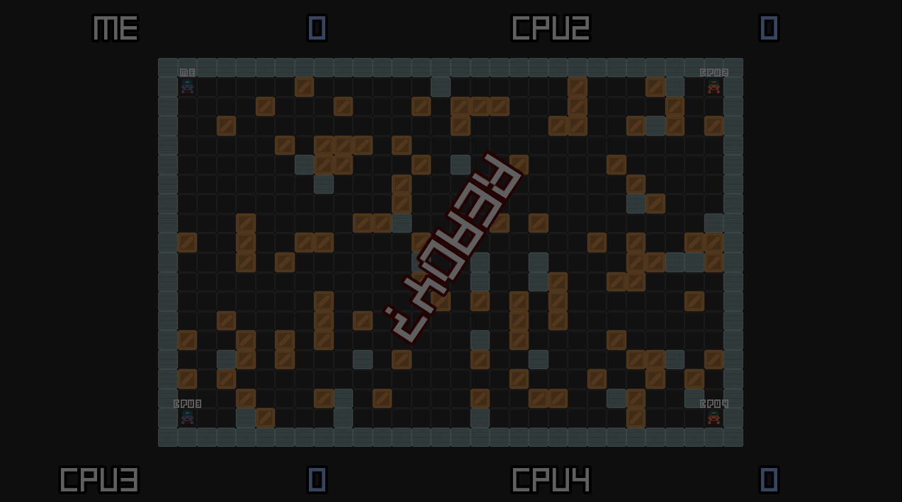

# Bombertest

Simple Bomberman-like clone, for training purposes.

It was made to explore the following domains:

- AI (for bots),
- Procedural generation (for now a stupid level generation algorithm),
- Networking (host/join model with a listen server, with an HTML5 compatible client using WebSockets)

**[:rocket: Play it here!](https://srynetix.github.io/bombertest/)**
